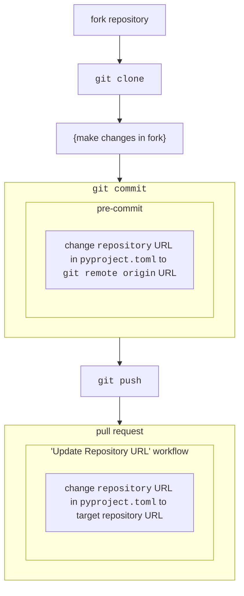

# Contributing to "Regression Testing C-PAC on SLURM Clusters"

## Forking this repository

If you're making any changes to secrets or environment variables, please test in a fork of this repository. [`pre-commit`](https://github.com/FCP-INDI/C-PAC/blob/main/CONTRIBUTING.md#pre-commit) is [configured in this repository](https://github.com/childmindresearch/slurm_testing/blob/977061120765151334a2e9d3257102d4a368d791/.pre-commit-config.yaml#L81-L87) to update the [`repository` URL in `pyproject.toml`](https://github.com/childmindresearch/slurm_testing/blob/977061120765151334a2e9d3257102d4a368d791/pyproject.toml#L9) to match the  URL for the local `git remote` named `origin`, and [a GitHub Actions workflow is configured](https://github.com/childmindresearch/slurm_testing/blob/977061120765151334a2e9d3257102d4a368d791/.github/workflows/match_target_repository.yaml) to match that URL to the target repository when a pull request is opened, reopened, or synced.

To skip the local update, you can run `SKIP=local-fork-repo-url git commit` where you would normally run `git commit`.

## See Also

Please see [the C-PAC Contributing Guide](https://github.com/FCP-INDI/C-PAC/blob/main/CONTRIBUTING.md), the FCP-INDI [Contributing Guide](https://github.com/FCP-INDI/.github/blob/main/CONTRIBUTING.md) and [Contributor Covenant Code of Conduct](https://github.com/FCP-INDI/.github/blob/main/CODE_OF_CONDUCT.md) for more general contributing guidelines.
