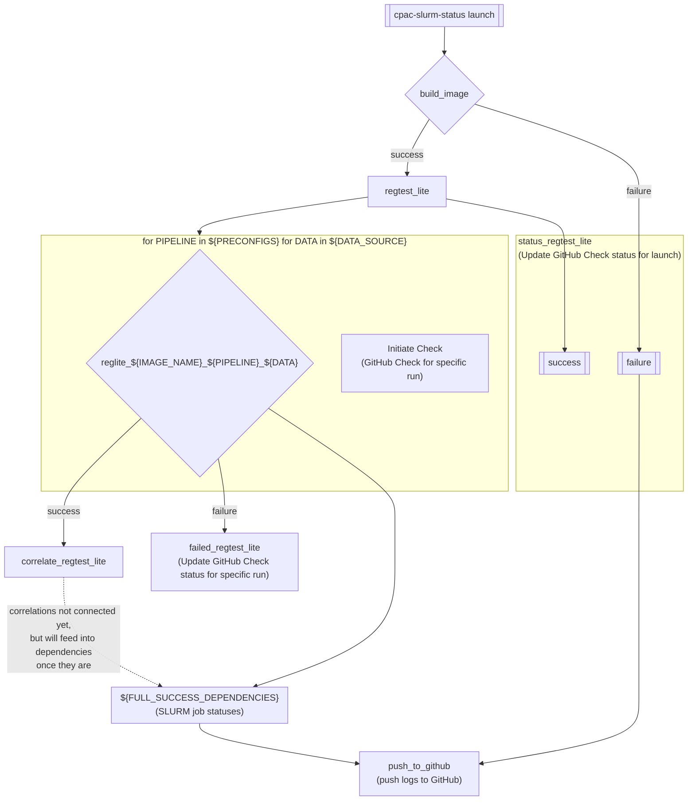

# Regression Testing on SLURM Clusters (Bridges-2)

This Github repo allows [C-PAC developers](https://github.com/orgs/FCP-INDI/teams/developers) to run full regression tests on [Bridges-2, a cluster under Pittsburgh Computing Center](https://www.psc.edu/resources/bridges-2/user-guide/).
The scripts in this repo allow you to submit `sbatch` jobs on Bridges-2.

Note: this repository is currently in the process of transitioning to a <span title="continuous integration">CI</span>-initiated flow from a manually initiated flow and contains code and documentation for both during the transition period.

## GitHub Actions initiated

### Launch a 'lite' regression test run

Set up a GitHub Actions workflow configuration file to call [`cpac-slurm-status launch`](./src/cpac_slurm_testing/status/cli.py#L209-L222). Use contexts, secrets and environment variables to pass the required variables to the script from GitHub Actions.

#### Required variables

* `HOME_DIR`: Home directory of the machine user on the remote server (e.g., `/ocean/projects/med####p/${USERNAME}`).
* `IMAGE`: The name and tag of the image to test (e.g., `ghcr.io/fcp-indi/c-pac:nightly`).
* `OWNER`: The owner of the C-PAC repository being tested (e.g., `FCP-INDI`).
* `PATH_EXTRA`: Any paths that need to be added to `PATH` to run these scripts on the remote server as the machine user.
* `REPO`: The name of the C-PAC repository being tested (e.g., `C-PAC`).
* `SHA`: The SHA of the commit or name of the branch or tag being tested.

#### Steps for launch from GitHub Actions

1. Get branch to test ([e.g.](https://github.com/FCP-INDI/C-PAC/blob/eabf86cc4cb87a6d4fb42364ac954f2274770fa7/.github/workflows/regression_test_lite.yml#L31-L46)).
2. Configure action to authenticate to remote server ([e.g.](https://github.com/FCP-INDI/C-PAC/blob/eabf86cc4cb87a6d4fb42364ac954f2274770fa7/.github/workflows/regression_test_lite.yml#L48-L53)).
3. Initiate GitHub Check for test runs as "pending" ([e.g](https://github.com/FCP-INDI/C-PAC/blob/eabf86cc4cb87a6d4fb42364ac954f2274770fa7/.github/workflows/regression_test_lite.yml#L55-L61)).
4. Launch the test on the remote server. We're currently using the GitHub Actions Marketplace Action [SSH Remote Commands](https://github.com/marketplace/actions/ssh-remote-commands?version=v1.0.0) by Bo-Yi Wu to facilitate this step ([e.g.](https://github.com/FCP-INDI/C-PAC/blob/eabf86cc4cb87a6d4fb42364ac954f2274770fa7/.github/workflows/regression_test_lite.yml#L63-L80)).
5. Remove the configuration from step 2 above ([e.g.](https://github.com/FCP-INDI/C-PAC/blob/eabf86cc4cb87a6d4fb42364ac954f2274770fa7/.github/workflows/regression_test_lite.yml#L82-L84))

##### Example call to launch script

```BASH
sbatch \
  cpac_slurm_status launch \
  --wd="${{ env.SSH_WORK_DIR }}/logs/${{ github.sha }}" \
  --comparison-path="${{ env.COMPARISON_PATH }}" \
  --dashboard-repo="${{ env.DASHBOARD_REPO}}" \
  --home-dir="${{ env.SSH_WORK_DIR }}" \
  --image="${{ env.DOCKER_TAG }}" \
  --owner="${{ github.repository_owner }}" \
  --path-extra="${{ env.GH_CLI_BIN_PATH }}" \
  --repo="${{ github.repository }}" \
  --sha="${{ github.sha }}" \
  --slurm-testing-branch="${{ env.SLURM_TESTING_BRANCH }}" \
  --slurm-testing-repo="${{ env.SLURM_TESTING_REPO }}" \
  --token-file="${{ env.TOKEN_FILE }}"
```

Once launched, the code from this repository will orchestrate the launches (and eventually the correlations and reporting).

See [:octocat: `FCP-INDI/C-PAC/.github/workflows/regression_test_lite.yml`](https://github.com/FCP-INDI/C-PAC/blob/eabf86cc4cb87a6d4fb42364ac954f2274770fa7/.github/workflows/regression_test_lite.yml) for an example GitHub Actions workflow configuration file that calls this script.

#### What this repository does once launched



## Manually initiated

### Installation Guide

1. `SSH` into Bridges-2
2. In your project home directory (typically `/ocean/projects/med####p/{username}`),
   clone this repo

   ```shell
   git clone git@github.com:amygutierrez/slurm_testing.git
   ```

3. You're ready to start testing! :technologist:

### What does a C-PAC Regression Test entail?

Regression testing for C-PAC means that certain pipelines and certain datasets will be used for testing.
Full regression testing requires ALOT of computaional resources, so will need to run this on a cluster.

Regression testing pipelines tested:

- default
- benchmark-FNIRT
- fmriprep-options
- ndmg
- fx-options
- abcd-options
- ccs-options
- rodent
- monkey

Regression testing datasets used:

- KKI (5 subjects)
- HNU_1 (5 subjects)
- Site-CBIC (4 subjects)
- Site-SI (3 subjects)

### Script Details

#### [`regtest_job_seed.sh`](./regression_run_scripts/regtest_job_seed.sh)

This script will run the Apptainer image provided against the pipelines and datasets detailed above.
Every pipeline has fixed the `random_seed` value to `77742777`

```txt
Arguments:
--username {username}                             Provide your Bridges-2 username
--out_dir {path/to/desired/output/directory}      Provie the absolute path for the regression test outputs.
--image_dir {path/to/image.sif}                   Provide the absolute path to the Apptainer image you want to use
```

##### EXAMPLE

To run this script on Bridges-2

```BASH
bash "/${PATH_TO_REPO}/regression_run_scripts/regtest_job_seed.sh" --username "${USERNAME}" \
--out_dir "/ocean/projects/med####p/${USERNAME}/regression_test" \
--image_dir "/ocean/projects/med####p/${USERNAME}/cpac_nightly.sif"
```

#### [`regtest_job_cpac_code.sh`](./regression_run_scripts/regtest_job_cpac_code.sh)

This script will run the Apptainer image provided _with_ CPAC branch changes against the pipelines and datasets detailed above.
Every pipeline has fixed the `random_seed` value to `77742777`

```txt
Arguments:
--username {username}                             Provide your Bridges-2 username
--out_dir {path/to/desired/output/directory}      Provie the absolute path for the regression test outputs.
--image_dir {path/to/image.sif}                   Provide the absolute path to the Apptainer image you want to use
--cpac_dir {path/to/cpac/directory}               Provide the absolute path to CPAC git repository. Make sure C-PAC points
to desired branch you want to test
```

##### EXAMPLE

To run this script on Bridges-2

```BASH
bash "/${PATH_TO_REPO}/regression_run_scripts/regtest_job_seed.sh" --username "${USERNAME}" \
--out_dir "/ocean/projects/med####p/${USERNAME}/regression_test" \
--image_dir "/ocean/projects/med####p/${USERNAME}/cpac_nightly.sif" \
--cpac_dir "/ocean/projects/med####p/${USERNAME}/C-PAC"
```

### TIPS!

- When running these scripts, run them inside a temporary directory that you can delete later.
This is because bash scripts and slurm.out files will get written into the current directory. Example:

```BASH
mkdir -p ./temp_reg_runs

cd ./temp_reg_runs

bash "/${PATH_TO_REPO}/regression_run_scripts/regtest_job_seed.sh" --username "${USERNAME}" \
--out_dir "/ocean/projects/med####p/${USERNAME}/regression_test" \
--image_dir "/ocean/projects/med####p/${USERNAME}/cpac_nightly.sif" \
--cpac_dir "/ocean/projects/med####p/${USERNAME}/C-PAC"
```

- If you are testing a specific C-PAC branch, make sure that you pull the branch changes in the C-PAC directory _before_ running `regtest_job_cpac_code.sh`
